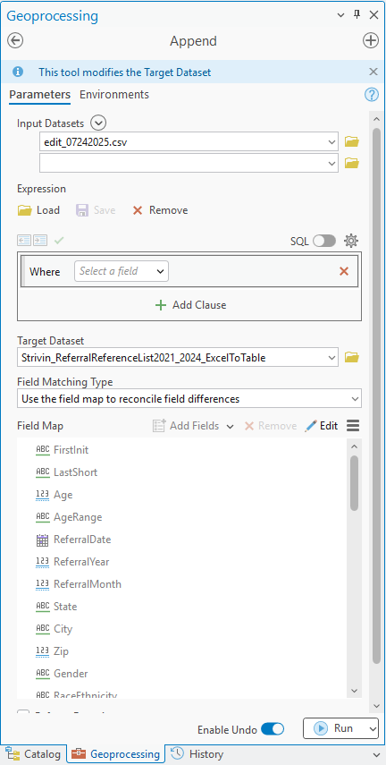

# COMBAT STRiVIN' Referrals Dashboard
## Last Updated by Joseph Cho (08-05-2025)

Data collection and cleaning process (ETL) for updating and maintaining the [COMBAT STRiVIN' Referrals Dashboard](https://combat-geospatial-hub-jacksoncomo.hub.arcgis.com/apps/3e27cf2d103d417e82a2bf7f254ccbac/explore)

## Background 
The COMBAT STRiVIN' Referrals Dashboard is a public dashboard maintained by Jackson County COMBAT. The dashboard displays summary information on the clients who have been referred for social services through the COMBAT STRiVIN' Hub Program. 

## COMBAT STRiVIN' 

[COMBAT STRiVIN'](https://www.jacksoncountycombat.com/referrals) (**S**triving **T**ogether to **R**educe **V**iolence **I**n **N**eighborhoods) is a comprehensive approach to reducing violence in Jackson County. By bringing all corners of the local criminal justice system together: police officers, school administrators, mental health professionals, social workers, faith-based leaders, elected officials, and local citizens, STRiVIN uses a data-driven approach to target hot spots of violent crime in Jackson County by funding and supporting innovative prevention and treatment programs. 

There are currently five [STRiVIN' hubs](https://www.jacksoncountycombat.com/858/STRiVIN-Hubs) strategically placed across Jackson County: 
1. South Kansas City (The Hope Hangout, Hickman Mills Prevention Coalition / Hickman Mills School District, Burke Academy)
    - 11115 Bennington Ave, Kansas City, MO 64134
    - Director and Hub Resource Coordinator: Marva Moses
2. Northeast Kansas City (The Mattie Rhodes Center)
    - 148 N Topping Ave, Kansas City, MO 64123
    - Director and Hub Resource Coordinator: Molly Manske
3. Independence (Community Services League - CSL, Hawthorne Place Apartments)
    - 16995 Dover Lane, Independence, MO 64056
    - Director and Hub Resource Coordinator: Jennifer Manuleleua
4. Raytown (The Safe Zone, Sisters in Christ)
    - 6108 Blue Ridge Blvd, Raytown, MO 64133
    - Directyor and Hub Resource Coordinator: Carolyn Whitney
5. Midtown Kansas City (Greater Impact, Greater Metropolitan Church of Christ)
    - 3735 Wabash Ave, Kansas City, MO 64109
    - Director and Hub Resource Coordinator: Pastor Branden Mims

In 2021, COMBAT launched the STRiVIN' Social Services Referrals program, whereby individuals in distress can be directly connected to local community resources. In partnership with CCL (Community Care Link), COMBAT oversees an end-to-end referral system where a police officer can go to the online referral (via a URL) and refer a potential client on the spot for social services. Once the referral is complete, the referral is routed to one of the five STRiVIN' hub agencies for screening, during which the client will be contacted and assessed for what exact needs are to (and can) be addressed. 

## Set up Instructions
1. Clone git repository 
2. Create virtual environment and install dependencies (just pandas)
```bash
python -m venv <venv name>
<venv name>\Scripts\activate
pip install pandas # arcpy, arcgis
```
3. Set up sub-folders: 
<pre>
```
root/
├── DATA/
│   ├── RAW/
│   │   
│   └── CLEANED/
└── README.md
└── clean_data.py
```
</pre>
4. Add raw data files to `DATA/RAW`

## Extract, Transform, Load Process 
1. The raw datafile that feeds the current STRiVIN' Referrals Dashboard is the **STRIVIN Referrals Data Extract** that can be found under the Report Menu of the [COMBAT Connections portal](https://combatconnections.org/). These reports are also delivered via an automated FTP every Sun & Thurs.
    - The raw datafile is cumulative datafile that reports on all existing client referrals since the beginning of the program, from the summer of 2022. 
2. The raw datafile requires minor cleaning prior to updating the dashboard. Run clean_data.py to get the cleaned datafile.
    - You will need to open the feature layer `Strivin_ReferralReferenceList2021_2024_ExcelToTable` to confirm the latest `ReferralDate` date
3. Import the edit_MMDDYYYY.csv file to ArcGIS Pro and apply the `Append` tool 



4. Save changes, your project, and confirm that the changes are reflected in the (dashboard)[https://combat-geospatial-hub-jacksoncomo.hub.arcgis.com/apps/3e27cf2d103d417e82a2bf7f254ccbac/explore].

## ***Issues to Address***
There are a number of issues with the current iteration of the COMBAT STRiVIN' Referrals Dashboard that need to be addressed:
1. The current dashboard does not account for changes in client case status with the current `Append` updating process.
2. The current dashboard is overcounting the number of clients referred (as the same client can be represented multiple times in the raw data file). 
    - More robust data cleaning needs to be added to properly calculate the number of clients / summarize client information.

## Other Links
- [What is STRiVIN'?](https://www.jacksoncountycombat.com/1030/What-Is-STRiVIN)
- [Jackson County COMBAT](https://www.jacksoncountycombat.com/)